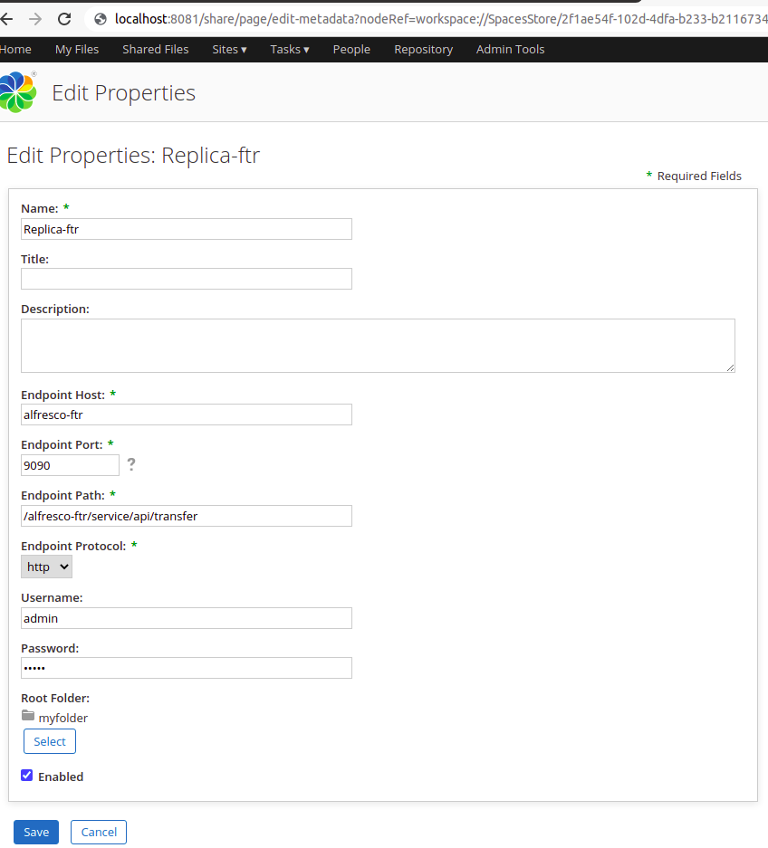
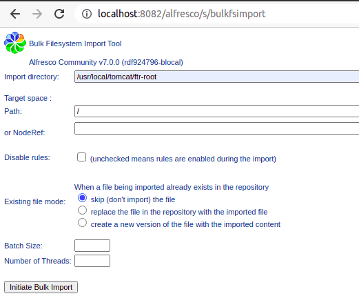

# Alfresco Community 7
# Transfer data from a alfrescoA to a alfrescoB

## How do I get set up?

$ curl https://artifacts.alfresco.com/nexus/content/groups/public/org/alfresco/alfresco-ftr-distribution/7.0.0/alfresco-ftr-distribution-7.0.0.zip --output alfresco-ftr/alfresco-ftr-distribution-7.0.0.zip

$ unzip alfresco-ftr/alfresco-ftr-distribution-7.0.0.zip -d alfresco-ftr/alfresco-ftr-distribution-7.0.0

$ docker-compose up -d

## Importing and transferring files

**Importing and transferring files [https://docs.alfresco.com/content-services/community/admin/import-transfer/](https://docs.alfresco.com/content-services/community/admin/import-transfer/)**

1. Go to alfrescoA repository and create a myfolder directory with files via shareA
    * http://localhost:8081/share
2. According to the documentation it is necessary to create a "replica"

3. Create job to copy documents from "myfolder" to transfer target
4. Once the transfer is complete, access the alfresco bulkimport and import the data

5. Access shareB and check that the import is OK
    * http://localhost:8083/share

### Advantages and disadvantages ###
    * Very fast process
    * Not keep UUIDs, creator user, etc

